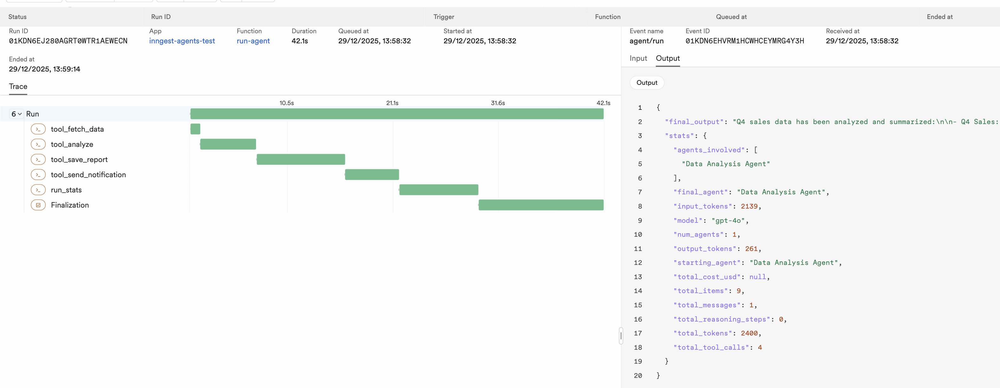

# inngest-agents

Durable, observable agent runs for the OpenAI Agents SDK using Inngest.

## Why?

When running AI agents in production, you need:

- **Durability** — If a step fails, don't re-run expensive LLM calls or side effects
- **Observability** — See every tool call, its inputs/outputs, and aggregate stats
- **Cost tracking** — Know how many tokens and dollars each run consumed

This library wraps OpenAI Agents SDK tools as Inngest steps, giving you all of this with minimal code changes.

## How It Works

1. **Ambient context** — Call `set_step(ctx.step)` once at the start of your Inngest function
2. **Wrap tools** — Use `as_step(tool)` to make any `@function_tool` a durable Inngest step
3. **Finalize runs** — Call `finalize_run()` to log aggregate stats (tokens, cost, agents involved)

Each tool execution becomes a memoized step. On retry, completed steps return cached results instead of re-executing.

## Installation

```bash
uv sync                    # Core dependencies
uv sync --extra dev        # + pytest, ruff
uv sync --extra cost       # + litellm for cost calculation
uv sync --all-extras       # Everything
```

## Quick Start

### 1. Define tools (standard OpenAI Agents SDK)

```python
from agents import Agent, function_tool
from inngest_agents import as_step

@function_tool
async def fetch_data(source: str) -> dict:
    """Fetch from external API."""
    return await api.get(source)

@function_tool
def analyze(data: dict) -> str:
    """Pure computation."""
    return f"Analysis: {data}"

# Wrap tools with as_step() for durability
agent = Agent(
    name="analyst",
    tools=[as_step(fetch_data), as_step(analyze)],
)
```

### 2. Create Inngest function

```python
import inngest
from agents import Runner
from inngest_agents import set_step, finalize_run

inngest_client = inngest.Inngest(app_id="my-app")

@inngest_client.create_function(
    fn_id="run-agent",
    trigger=inngest.TriggerEvent(event="agent/run"),
)
async def run_agent(ctx: inngest.Context) -> dict:
    set_step(ctx.step)  # Enable durability for all tools
    
    result = await Runner.run(agent, ctx.event.data["prompt"])
    finalized = await finalize_run(result, agent.name)
    
    return finalized.to_dict()
```

### 3. Run locally

Terminal 1 — Inngest dev server:
```bash
npx inngest-cli@latest dev --port 9001 -u http://localhost:8000/api/inngest
```

Terminal 2 — Your app:
```bash
uv run uvicorn tests.app:app --reload --port 8000
```

Open http://127.0.0.1:9001 to see runs and steps.



## API Reference

### `set_step(step)`

Set the Inngest step context. Call once at the start of your Inngest function.

### `as_step(tool) -> FunctionTool`

Wrap a `@function_tool` to run as an Inngest step. Each call is memoized and logged with input/output.

```python
agent = Agent(tools=[as_step(my_tool)])
```

### `finalize_run(result, agent_name, model="gpt-4o") -> FinalizedRun`

Compute and log aggregate stats after `Runner.run()` completes. Returns:

```python
FinalizedRun(
    final_output="...",
    stats=RunStats(
        total_tool_calls=3,
        total_messages=2,
        agents_involved=["Triage Agent", "Sales Agent"],
        input_tokens=1234,
        output_tokens=567,
        total_cost_usd=0.0087,  # Requires litellm
        ...
    )
)
```

### `durable(step_id, fn) -> T`

Low-level helper to wrap any async function in `step.run()`. Prefer `as_step()` for tools.

```python
result = await durable("fetch_weather", lambda: get_weather(city))
```

## Running Tests

```bash
# Start Inngest dev server (terminal 1)
npx inngest-cli@latest dev --port 9001 -u http://localhost:8000/api/inngest

# Start test app (terminal 2)
OPENAI_API_KEY=sk-... uv run uvicorn tests.app:app --reload --port 8000

# Run tests (terminal 3)
uv run pytest tests/test_integration.py -v
```

## Project Structure

```
src/inngest_agents/
├── __init__.py     # Public exports
├── context.py      # set_step, get_step, as_step, durable
├── schemas.py      # RunStats, FinalizedRun dataclasses
└── stats.py        # finalize_run, cost estimation

tests/
├── agent.py        # Example agents (Sales, Support, Triage)
├── app.py          # FastAPI + Inngest serve endpoint
└── test_integration.py
```

## License

MIT
